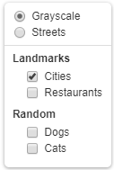

Leaflet.groupedlayercontrol
===========================

Leaflet layer control with support for grouping overlays together.



[Demo](http://ismyrnow.github.io/Leaflet.groupedlayercontrol/example/basic.html)

## Installation

Include the compressed JavaScript and CSS files located in the `/dist` folder.

This project is also available via bower:

```
bower install leaflet-groupedlayercontrol
```

## Usage

### Initialization

Add groupings to your overlay layers object, and swap out the default layer
control with the new one.

```javascript
var groupedOverlays = {
  "Landmarks": {
    "Motorways": motorways,
    "Cities": cities
  },
  "Points of Interest": {
    "Restaurants": restaurants
  }
};

var options = { exclusiveGroups: ["Landmarks"] };

L.control.groupedLayers(baseLayers, groupedOverlays, options).addTo(map);
```

The [example](example/basic.html) shows its usage with various layers.

### Adding a layer

Adding a layer individually works similarly to the default layer control,
except that you can also specify a group name, along with the layer and layer name.

```javascript
layerControl.addOverlay(cities, "Cities", "Landmarks").
```

## Note

This plugin only affects how the layers are displayed in the layer control,
and not how they are rendered or layered on the map.

Grouping base layers is not currently supported, but adding exclusive layer
groups is. Layers in an exclusive layer group render as radio inputs.

## License

Leaflet.groupedlayercontrol is free software, and may be redistributed under
the MIT-LICENSE.
